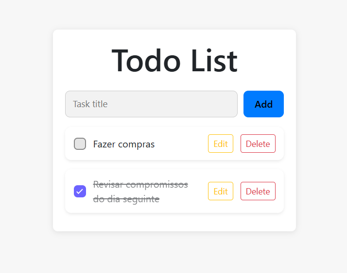

# 📘 Documentação Geral do Projeto

## 🛠️ Tecnologias Utilizadas
- **Backend:** Spring Boot
- **Banco de Dados:** MySQL
- **Infra:** Docker Compose (sobe o MySQL já com scripts SQL iniciais)
- **Frontend:** React + TypeScript (Vite)

---

## 🔧 Backend (Spring Boot)
- API REST estruturada seguindo boas práticas.
- Comunicação com MySQL via JPA/Hibernate.
- Scripts SQL são executados automaticamente ao iniciar o container do banco.
- Endpoints responsáveis por CRUD das tarefas (create, read, update, delete).

---

## 🗄️ Banco de Dados (MySQL em Docker)
- Rodando via `docker-compose.yml`.
- Banco inicializado automaticamente com:
    - Tabelas necessárias
- Persistência de dados através de volume Docker.

---

## 🎨 Frontend (React + TypeScript + Vite)
- Interface simples e funcional para gestão de tarefas.
- Componentização:
    - `TaskForm` – criação de tarefas
    - `TaskList` – lista de tarefas
    - `TaskItem` – item individual com edição, exclusão e toggle
- Uso de **CSS Modules** para estilização isolada.
- Comunicação com backend via axios.

---

## 📸 Screenshot do Frontend


---

## ▶️ Como Rodar o Projeto

### 1. Backend
```sh
./mvnw spring-boot:run
``` 
## 2. Banco via Docker
```sh
# no diretório com docker-compose.yml
docker-compose up -d
``` 
## 3. Frontend
``` sh
# no diretório do frontend
npm install
npm run dev
# padrão Vite: http://localhost:5173
```
